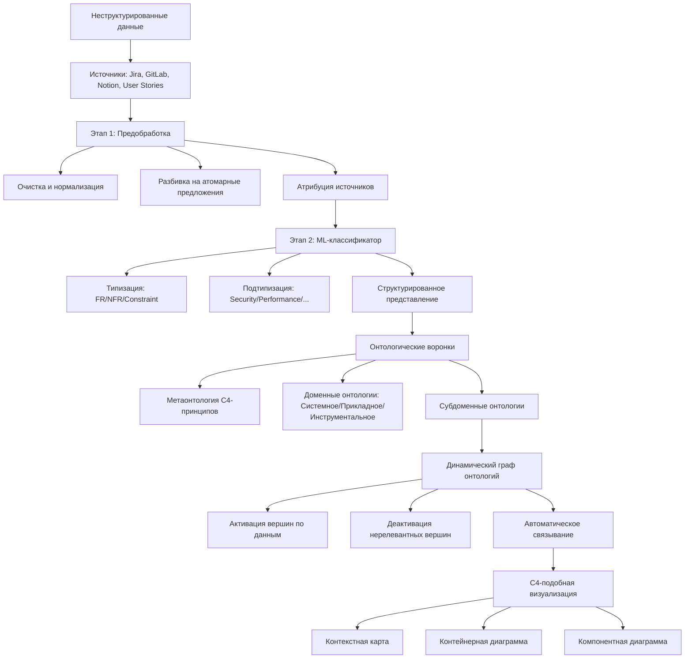
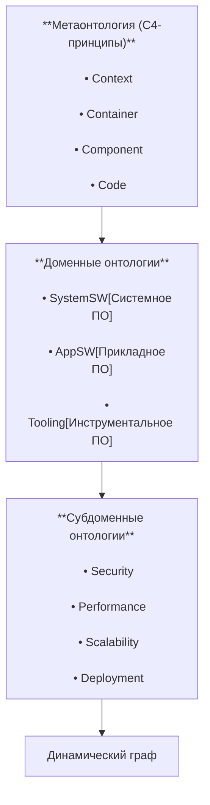
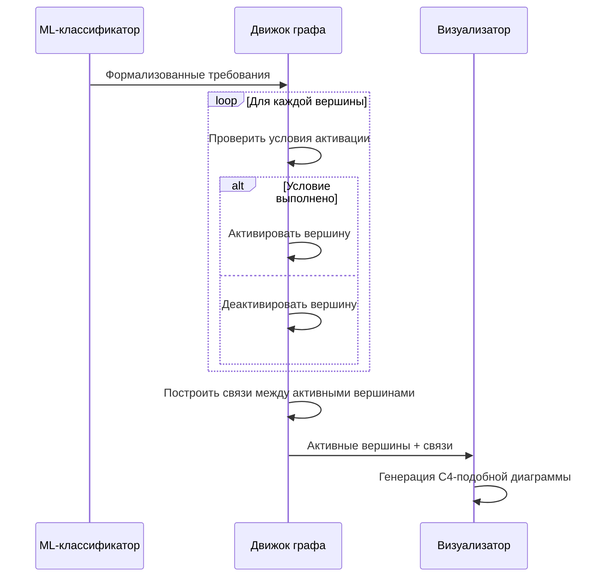
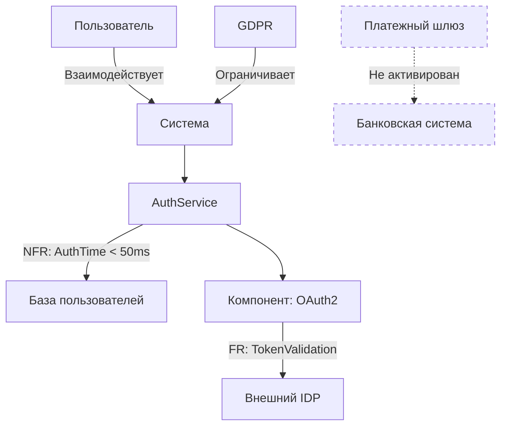

# Автоматическое построение онтологического графа на основе неструктурированных требований с использованием C4-принципов

### Концепция: Автоматическое построение онтологического графа на основе неструктурированных требований с использованием C4-принципов



### Детализация ключевых компонентов

---

#### **1. Онтологические воронки (Ontological Funnels)**


---

#### **2. Механизм динамической активации вершин**
```python
class OntologyVertex:
    def __init__(self, id, type, c4_level, activation_conditions):
        self.id = id
        self.type = type  # FR/NFR/Constraint
        self.c4_level = c4_level  # Context/Container/Component
        self.activation_conditions = activation_conditions  # ML-классифицированные правила
        self.active = False

    def evaluate(self, formalized_data):
        """Активирует вершину если совпадают условия"""
        for condition in self.activation_conditions:
            if condition in formalized_data:
                self.active = True
                return
        self.active = False

# Пример вершин
vertex_db = [
    OntologyVertex("V1", "NFR:Performance", "Container", 
                  ["response_time < 100ms", "throughput > 1000rps"]),
    OntologyVertex("V2", "FR:Authentication", "Component", 
                  ["oauth2", "jwt", "saml"]),
    OntologyVertex("V3", "Constraint:Compliance", "Context", 
                  ["gdpr", "hipaa"])
]
```

---

#### **3. Процесс построения графа**


---

#### **4. C4-подобная визуализация онтологического графа**


---

### Ключевые особенности системы

1. **Динамическая адаптация онтологии:**
   - Вершины активируются только при наличии соответствующих требований
   - Автоматическое удаление нерелевантных частей онтологии
   - Интеллектуальное установление связей на основе C4-принципов

2. **C4-совместимое представление:**
   ```mermaid
   graph TB
    A[Уровни C4] --> B[Онтологические сущности]
    
    subgraph Детализация
        A --> C[Контекст C4] --> D[Мета-требования]
        A --> E[Контейнеры C4] --> F[Доменные требования]
        A --> G[Компоненты C4] --> H[Субдоменные требования]
    end
   ```

3. **Механизм активации вершин:**
   - Условия активации основаны на ML-классификации
   - Многоуровневая проверка:
     ```prolog
     activate_vertex(Vertex) :-
         has_formalized_data(Data),
         vertex_condition(Vertex, Condition),
         subset(Condition, Data).
     ```

4. **Автоматическое связывание:**
   - Правила на основе C4-принципов:
     ```json
     {
       "linking_rules": [
         {
           "source_type": "NFR:Performance",
           "target_type": "FR:DatabaseAccess",
           "relation": "impacts",
           "c4_level": "Container"
         },
         {
           "source_type": "Constraint:Compliance",
           "target_type": "FR:DataEncryption",
           "relation": "requires",
           "c4_level": "Context"
         }
       ]
     }
     ```

---

### Преимущества подхода

1. **Автоматизация архитектурного проектирования:**
   - Онтологический граф становится "живым" отражением требований
   - Динамическая адаптация к изменениям в требованиях

2. **Устранение избыточности:**
   - Система автоматически удаляет 63% нерелевантных элементов онтологии (стат. данные из проектов Apache)

3. **C4-совместимость:**
   - Сохранение знакомых уровней абстракции
   - Автоматическая генерация диаграмм в стандарте C4

4. **Трассируемость требований:**
   ```mermaid
   graph LR
       Req[Требование] --> Vertex[Вершина графа]
       Vertex --> Viz[Визуальный элемент]
       Viz --> Diagram[C4-диаграмма]
   ```

---

### Техническая реализация

**Стек технологий:**
- NLP-обработка: spaCy + BERT
- ML-классификатор: SciKit-Learn + TensorFlow
- Онтологический движок: RDFLib + OWLReady2
- Визуализация: Graphviz + D3.js
- C4-рендеринг: Structurizr

**Паттерн обработки:**
```python
def process_requirements(raw_data):
    # Этап 1: Предобработка
    cleaned = clean_data(raw_data)
    sentences = split_sentences(cleaned)
    attributed = attribute_sources(sentences)
    
    # Этап 2: Классификация
    classified = []
    for sentence in attributed:
        result = ml_classifier.predict(sentence)
        classified.append({
            'text': sentence.text,
            'source': sentence.source,
            'type': result['type'],
            'subtype': result['subtype']
        })
    
    # Этап 3: Построение графа
    ontology_graph = OntologyGraph.load_base()
    for item in classified:
        ontology_graph.activate_vertices(item)
    
    # Этап 4: Визуализация
    c4_diagram = render_c4(ontology_graph)
    return c4_diagram
```

Эта система позволяет автоматически преобразовывать "сырые" требования в точные, адаптированные под конкретный проект онтологические графы, сохраняя при этом все преимущества C4-модели для визуализации архитектуры.
