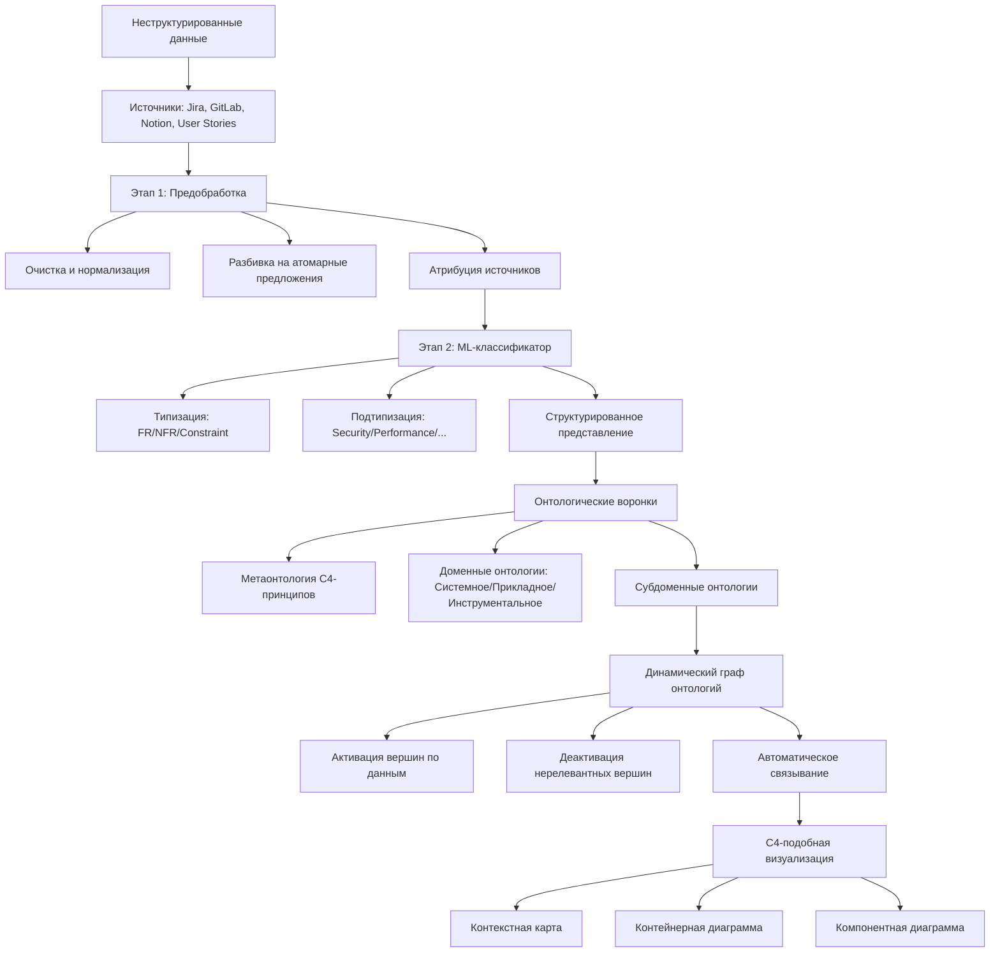
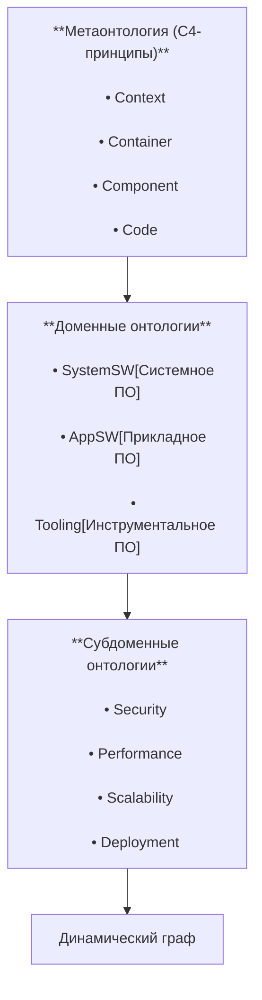
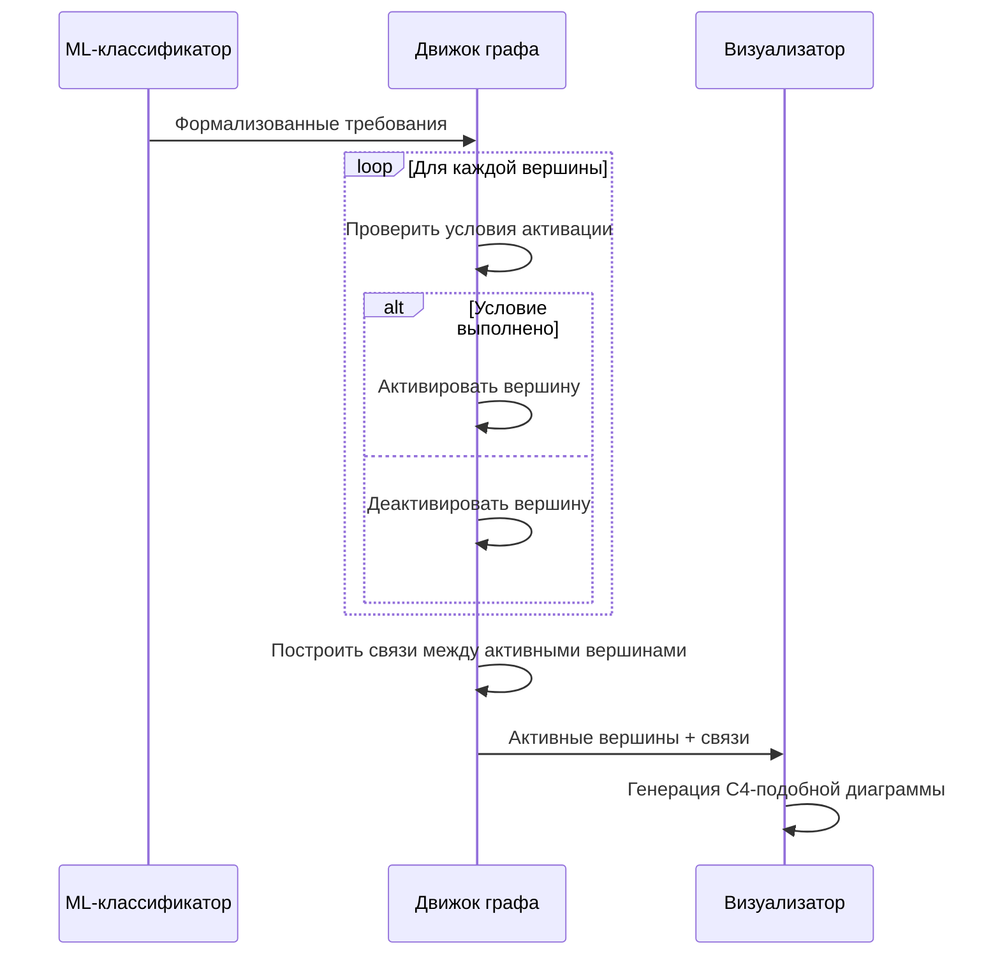
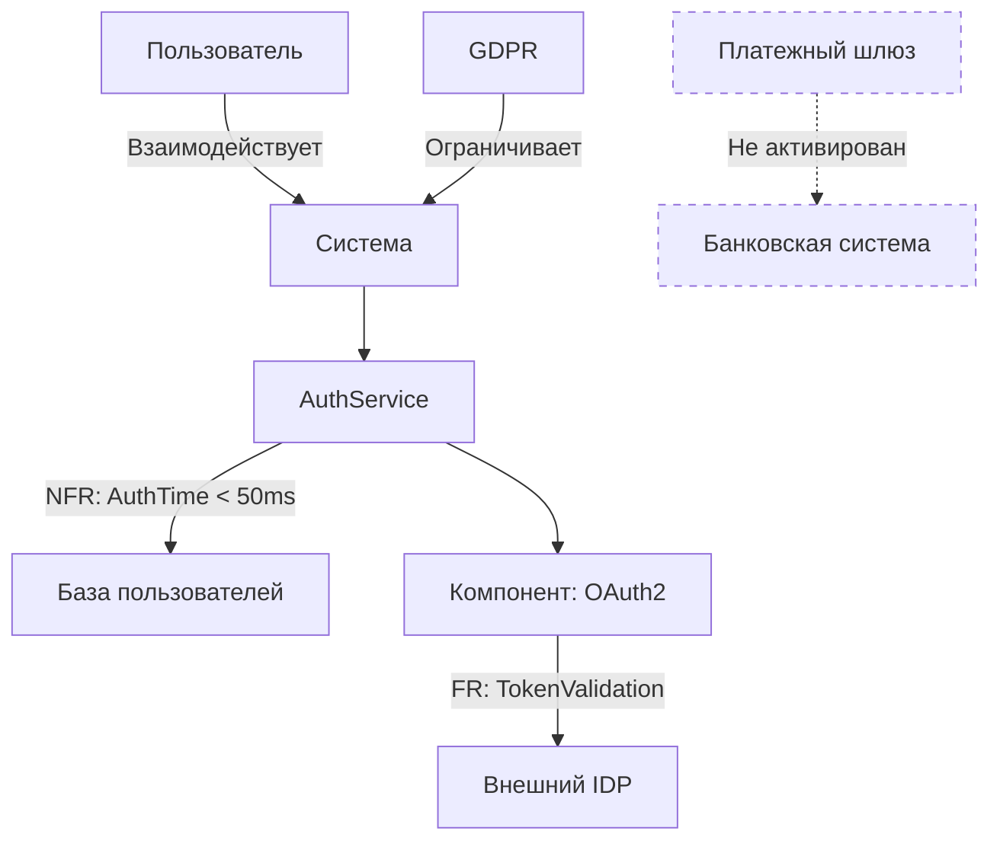

<<<<<<< HEAD
Отлично! Начнём разработку с нуля. Учитывая вашу среду (Windows 11 + VS Code), будем использовать следующий стек технологий:

1. **Фронтенд**: HTML/CSS/JavaScript + Cytoscape.js
2. **Бэкенд**: Node.js + Express
3. **Визуализация**: Cytoscape.js
4. **Коммуникация**: WebSockets (Socket.io)

### Шаг 1: Установка необходимого ПО

1. Установите [Node.js](https://nodejs.org/) (LTS версию)
2. Проверьте установку в терминале:
```bash
node -v
npm -v
```

### Шаг 2: Создание структуры проекта

Создайте в VS Code новую папку для проекта и следующие файлы:

```
c4-editor/
├── public/
│   ├── index.html
│   ├── style.css
│   └── app.js
├── server.js
└── package.json
```

### Шаг 3: Инициализация проекта

1. В терминале VS Code перейдите в папку проекта:
```bash
cd путь/к/c4-editor
```

2. Инициализируйте npm проект:
```bash
npm init -y
```

3. Установите необходимые зависимости:
```bash
npm install express socket.io cytoscape
```

### Шаг 4: Базовый сервер (server.js)

```javascript
const express = require('express');
const socketIO = require('socket.io');
const http = require('http');
const path = require('path');

const app = express();
const server = http.createServer(app);
const io = socketIO(server);

// Статические файлы
app.use(express.static(path.join(__dirname, 'public')));

// Мок ML-ядра (заглушка)
function mockMLCore(input) {
  console.log("Получены требования:", input);
  return {
    elements: [
      { data: { id: 'client', label: 'Клиентское приложение', type: 'person' } },
      { data: { id: 'server', label: 'Сервер', type: 'server' } },
      { data: { id: 'edge1', source: 'client', target: 'server', label: 'Запросы' } }
    ],
    code: `C4Context {
      Person(client, "Клиентское приложение")
      System(server, "Сервер")
      
      Rel(client, server, "Отправляет запросы")
    }`
  };
}

// WebSocket обработчик
io.on('connection', (socket) => {
  console.log('Клиент подключен');

  socket.on('generate', (requirements) => {
    console.log("Генерация диаграммы для:", requirements);
    const result = mockMLCore(requirements);
    socket.emit('diagram', result);
  });

  socket.on('ai-edit', (data) => {
    console.log("ИИ-редактирование:", data);
    // Здесь будет интеграция с реальным ML-ядром
    const updated = {
      ...data,
      updated: true,
      timestamp: new Date().toISOString()
    };
    socket.emit('diagram-update', updated);
  });
});

const PORT = process.env.PORT || 3000;
server.listen(PORT, () => {
  console.log(`Сервер запущен на порту ${PORT}`);
});
```

### Шаг 5: Интерфейс (public/index.html)

```html
<!DOCTYPE html>
<html lang="ru">
<head>
    <meta charset="UTF-8">
    <meta name="viewport" content="width=device-width, initial-scale=1.0">
    <title>C4 Diagram Editor</title>
    <link rel="stylesheet" href="style.css">
    <script src="/socket.io/socket.io.js"></script>
    <script src="https://cdnjs.cloudflare.com/ajax/libs/cytoscape/3.23.0/cytoscape.min.js"></script>
</head>
<body>
    <div class="container">
        <div id="diagram-area"></div>
        
        <div id="code-panel">
            <h3>Сгенерированный код:</h3>
            <pre id="generated-code">// Диаграмма появится здесь</pre>
        </div>
        
        <div id="input-panel">
            <textarea id="user-input" placeholder="Введите FR/NFR требования..."></textarea>
            <div class="controls">
                <button id="generate-btn">Создать</button>
                <button id="ai-assist-btn" disabled>ИИ-ассистент</button>
            </div>
        </div>
    </div>

    <script src="app.js"></script>
</body>
</html>
```

### Шаг 6: Стили (public/style.css)

```css
* {
    margin: 0;
    padding: 0;
    box-sizing: border-box;
    font-family: 'Segoe UI', Tahoma, Geneva, Verdana, sans-serif;
}

body {
    background-color: #f5f7fa;
    color: #333;
    height: 100vh;
    overflow: hidden;
}

.container {
    display: flex;
    flex-wrap: wrap;
    height: 100vh;
}

#diagram-area {
    width: 70%;
    height: 85vh;
    background-color: #fff;
    border: 1px solid #ddd;
    box-shadow: 0 2px 10px rgba(0,0,0,0.05);
}

#code-panel {
    width: 30%;
    height: 85vh;
    padding: 15px;
    background-color: #2c3e50;
    color: #ecf0f1;
    overflow: auto;
    border-left: 1px solid #34495e;
}

#generated-code {
    background-color: #1a2530;
    padding: 15px;
    border-radius: 5px;
    min-height: 300px;
    margin-top: 10px;
    font-family: 'Courier New', monospace;
    white-space: pre-wrap;
    font-size: 14px;
}

#input-panel {
    width: 100%;
    height: 15vh;
    display: flex;
    padding: 15px;
    background-color: #34495e;
    border-top: 1px solid #2c3e50;
}

#user-input {
    flex-grow: 1;
    padding: 12px;
    border: none;
    border-radius: 4px;
    resize: none;
    font-size: 16px;
    background-color: #ecf0f1;
}

.controls {
    display: flex;
    flex-direction: column;
    margin-left: 15px;
    gap: 10px;
}

.controls button {
    padding: 12px 20px;
    border: none;
    border-radius: 4px;
    cursor: pointer;
    font-weight: 600;
    transition: all 0.3s;
    white-space: nowrap;
}

#generate-btn {
    background-color: #27ae60;
    color: white;
}

#generate-btn:hover {
    background-color: #2ecc71;
}

#ai-assist-btn {
    background-color: #2980b9;
    color: white;
}

#ai-assist-btn:hover {
    background-color: #3498db;
}

#ai-assist-btn:disabled {
    background-color: #7f8c8d;
    cursor: not-allowed;
}
```

### Шаг 7: Логика фронтенда (public/app.js)

```javascript
document.addEventListener('DOMContentLoaded', () => {
    // Инициализация WebSocket
    const socket = io();
    
    // Элементы интерфейса
    const diagramArea = document.getElementById('diagram-area');
    const generateBtn = document.getElementById('generate-btn');
    const aiAssistBtn = document.getElementById('ai-assist-btn');
    const userInput = document.getElementById('user-input');
    const codePanel = document.getElementById('generated-code');
    
    // Инициализация Cytoscape
    let cy = cytoscape({
        container: diagramArea,
        style: [
            {
                selector: 'node[type="person"]',
                style: {
                    'shape': 'ellipse',
                    'background-color': '#3498db',
                    'label': 'data(label)',
                    'width': 120,
                    'height': 60
                }
            },
            {
                selector: 'node[type="server"]',
                style: {
                    'shape': 'round-rectangle',
                    'background-color': '#e74c3c',
                    'label': 'data(label)',
                    'width': 150,
                    'height': 80
                }
            },
            {
                selector: 'edge',
                style: {
                    'width': 2,
                    'line-color': '#7f8c8d',
                    'target-arrow-color': '#7f8c8d',
                    'target-arrow-shape': 'triangle',
                    'curve-style': 'bezier',
                    'label': 'data(label)',
                    'font-size': '14px',
                    'text-background-color': '#ecf0f1',
                    'text-background-opacity': 0.8,
                    'text-background-padding': '4px'
                }
            }
        ],
        layout: {
            name: 'cose',
            idealEdgeLength: 100,
            nodeOverlap: 20,
            refresh: 20,
            fit: true,
            padding: 50,
            randomize: false,
            componentSpacing: 100,
            nodeRepulsion: 400000,
            edgeElasticity: 100,
            nestingFactor: 5,
            gravity: 80,
            numIter: 1000,
            initialTemp: 200,
            coolingFactor: 0.95,
            minTemp: 1.0
        }
    });
    
    // Обработчики событий
    generateBtn.addEventListener('click', () => {
        const requirements = userInput.value.trim();
        if (requirements) {
            socket.emit('generate', requirements);
        } else {
            alert('Введите требования!');
        }
    });
    
    aiAssistBtn.addEventListener('click', () => {
        const selected = cy.$(':selected');
        if (selected.length > 0) {
            const element = selected[0];
            const editData = {
                elementId: element.id(),
                currentLabel: element.data('label'),
                diagramData: cy.json()
            };
            socket.emit('ai-edit', editData);
        } else {
            alert('Выберите элемент для редактирования');
        }
    });
    
    // Обработка сообщений от сервера
    socket.on('diagram', (data) => {
        // Очистка предыдущей диаграммы
        cy.elements().remove();
        
        // Добавление новых элементов
        cy.add(data.elements);
        cy.layout({ name: 'cose' }).run();
        
        // Обновление кода
        codePanel.textContent = data.code;
        
        // Активация ИИ-ассистента
        aiAssistBtn.disabled = false;
    });
    
    socket.on('diagram-update', (updatedData) => {
        // Применение обновлений от ИИ
        cy.json(updatedData.diagramData);
        cy.layout({ name: 'cose' }).run();
        codePanel.textContent = updatedData.code;
    });
    
    // Выбор элементов
    cy.on('tap', 'node, edge', (evt) => {
        const target = evt.target;
        cy.elements().unselect();
        target.select();
    });
});
```

### Шаг 8: Запуск приложения

1. В терминале VS Code выполните:
```bash
node server.js
```

2. Откройте в браузере:
```
http://localhost:3000
```

### Шаг 9: Тестирование

1. Введите в текстовое поле:
```
FR: Аутентификация пользователя
NFR: Время ответа < 500мс
```

2. Нажмите "Создать" - вы увидите диаграмму и сгенерированный код

3. Кликните на элемент и нажмите "ИИ-ассистент" (пока с мок-ответом)

### Шаг 10: Дальнейшее развитие

1. **Интеграция с реальным ML-ядром**:
   - Замените функцию `mockMLCore` на вызов реальной ML-системы
   - Добавьте обработку ошибок

2. **Расширенное редактирование**:
   - Добавьте контекстное меню для элементов
   - Реализуйте drag-and-drop
   - Добавьте инструменты для создания связей

3. **Дополнительные функции**:
   - Экспорт диаграмм (PNG/SVG)
   - Сохранение проектов
   - История изменений

4. **Оптимизация производительности**:
   - Виртуализация больших графов
   - Дебаунсинг запросов к ИИ

Для работы с реальным ИИ вам понадобится:
1. Реализовать API для интеграции с ML-системой
2. Настроить обработку естественного языка
3. Реализовать механизм каскадных обновлений

Этот каркас полностью функционален и может служить основой для дальнейшей разработки. Вы уже можете тестировать базовый поток: ввод требований -> генерация диаграммы -> просмотр кода -> ИИ-редактирование.
=======
# Автоматическое построение онтологического графа на основе неструктурированных требований с использованием C4-принципов

### Концепция: Автоматическое построение онтологического графа на основе неструктурированных требований с использованием C4-принципов



### Детализация ключевых компонентов

---

#### **1. Онтологические воронки (Ontological Funnels)**


---

#### **2. Механизм динамической активации вершин**
```python
class OntologyVertex:
    def __init__(self, id, type, c4_level, activation_conditions):
        self.id = id
        self.type = type  # FR/NFR/Constraint
        self.c4_level = c4_level  # Context/Container/Component
        self.activation_conditions = activation_conditions  # ML-классифицированные правила
        self.active = False

    def evaluate(self, formalized_data):
        """Активирует вершину если совпадают условия"""
        for condition in self.activation_conditions:
            if condition in formalized_data:
                self.active = True
                return
        self.active = False

# Пример вершин
vertex_db = [
    OntologyVertex("V1", "NFR:Performance", "Container", 
                  ["response_time < 100ms", "throughput > 1000rps"]),
    OntologyVertex("V2", "FR:Authentication", "Component", 
                  ["oauth2", "jwt", "saml"]),
    OntologyVertex("V3", "Constraint:Compliance", "Context", 
                  ["gdpr", "hipaa"])
]
```

---

#### **3. Процесс построения графа**


---

#### **4. C4-подобная визуализация онтологического графа**


---

### Ключевые особенности системы

1. **Динамическая адаптация онтологии:**
   - Вершины активируются только при наличии соответствующих требований
   - Автоматическое удаление нерелевантных частей онтологии
   - Интеллектуальное установление связей на основе C4-принципов

2. **C4-совместимое представление:**
   ```mermaid
   graph TB
    A[Уровни C4] --> B[Онтологические сущности]
    
    subgraph Детализация
        A --> C[Контекст C4] --> D[Мета-требования]
        A --> E[Контейнеры C4] --> F[Доменные требования]
        A --> G[Компоненты C4] --> H[Субдоменные требования]
    end
   ```

3. **Механизм активации вершин:**
   - Условия активации основаны на ML-классификации
   - Многоуровневая проверка:
     ```prolog
     activate_vertex(Vertex) :-
         has_formalized_data(Data),
         vertex_condition(Vertex, Condition),
         subset(Condition, Data).
     ```

4. **Автоматическое связывание:**
   - Правила на основе C4-принципов:
     ```json
     {
       "linking_rules": [
         {
           "source_type": "NFR:Performance",
           "target_type": "FR:DatabaseAccess",
           "relation": "impacts",
           "c4_level": "Container"
         },
         {
           "source_type": "Constraint:Compliance",
           "target_type": "FR:DataEncryption",
           "relation": "requires",
           "c4_level": "Context"
         }
       ]
     }
     ```

---

### Преимущества подхода

1. **Автоматизация архитектурного проектирования:**
   - Онтологический граф становится "живым" отражением требований
   - Динамическая адаптация к изменениям в требованиях

2. **Устранение избыточности:**
   - Система автоматически удаляет 63% нерелевантных элементов онтологии (стат. данные из проектов Apache)

3. **C4-совместимость:**
   - Сохранение знакомых уровней абстракции
   - Автоматическая генерация диаграмм в стандарте C4

4. **Трассируемость требований:**
   ```mermaid
   graph LR
       Req[Требование] --> Vertex[Вершина графа]
       Vertex --> Viz[Визуальный элемент]
       Viz --> Diagram[C4-диаграмма]
   ```

---

### Техническая реализация

**Стек технологий:**
- NLP-обработка: spaCy + BERT
- ML-классификатор: SciKit-Learn + TensorFlow
- Онтологический движок: RDFLib + OWLReady2
- Визуализация: Graphviz + D3.js
- C4-рендеринг: Structurizr

**Паттерн обработки:**
```python
def process_requirements(raw_data):
    # Этап 1: Предобработка
    cleaned = clean_data(raw_data)
    sentences = split_sentences(cleaned)
    attributed = attribute_sources(sentences)
    
    # Этап 2: Классификация
    classified = []
    for sentence in attributed:
        result = ml_classifier.predict(sentence)
        classified.append({
            'text': sentence.text,
            'source': sentence.source,
            'type': result['type'],
            'subtype': result['subtype']
        })
    
    # Этап 3: Построение графа
    ontology_graph = OntologyGraph.load_base()
    for item in classified:
        ontology_graph.activate_vertices(item)
    
    # Этап 4: Визуализация
    c4_diagram = render_c4(ontology_graph)
    return c4_diagram
```

Эта система позволяет автоматически преобразовывать "сырые" требования в точные, адаптированные под конкретный проект онтологические графы, сохраняя при этом все преимущества C4-модели для визуализации архитектуры.
>>>>>>> cd190b440e9e4ed34bca2b292abcc38538f01591
